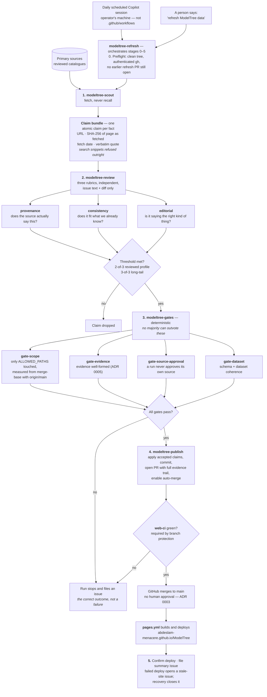

#  ModelTree

**The living family tree of AI models.**

**[Open the live site →](https://abdeslam-menacere.github.io/ModelTree/)**

A source-backed map of AI creators, model families, releases, and the
relationships between them. ModelTree helps you tell a *model* apart from the
product or platform that serves it, see what came before and after it, and
inspect comparable evidence without treating any one benchmark as universal
truth.

> AI model names mix creators, products, families, tiers, versions, aliases, and
> API identifiers. Existing directories optimise for breadth, pricing, or
> ranking — they rarely explain lineage, or keep enough context to make
> historical and benchmark claims trustworthy.

## What you can answer in seconds

1. Who created this model?
2. Which family and tier does it belong to?
3. When was it released, and what is its lifecycle state?
4. What related releases came before, beside, or after it?
5. Is it hosted, downloadable, or both — and where?
6. Which source supports each important fact?
7. Which evidence is genuinely comparable with another model?

## Principles

1. Clarity before completeness.
2. History is a first-class feature.
3. Important facts carry provenance and a verification date.
4. Unknown and conflicting data stay explicit.
5. Creator, model, product, and serving platform are separate entities.
6. Benchmarks are contextual evidence, not universal truth.
7. Accessibility and speed are requirements, not polish.
8. Data changes are reviewable repository changes.

## Not goals

Complete historical coverage at launch · live API monitoring · original
large-scale benchmark runs · a proprietary universal score · user accounts ·
ingestion without sources, review, and gates.

## Quick start

The site is an [Astro](https://astro.build) static build. All commands run from
`web/`:

```bash
cd web
npm ci
npm run dev
```

| Command | Action |
|---|---|
| `npm ci` | Install exactly from the lockfile |
| `npm test` | Data-integrity and URL-state tests |
| `npm run check` | Astro and TypeScript diagnostics |
| `npm run validate` | Tests and diagnostics together |
| `npm run build` | Validate, then build the static site to `dist/` |

## Layout

```
web/               the Astro site
  src/data/        seed data — organizations, families, releases, benchmarks, sources
  src/pages/       routes, including generated Model Passport pages
  src/lib/         data loading, validation, URL state
tools/updater/     proposal-only data updater (Python, run separately)
.github/skills/    the agent skills that refresh the data end to end
.github/agents/    the Drydock role contracts — dev, reviewer, QA
.github/workflows/ CI, the Pages deploy, and scheduled source-link health
.drydock/          per-dock records and the gate verdicts bound to each commit
docs/product/      product brief, information architecture, backlog, deployment runbook
docs/adr/          architecture decision records
docs/assets/       repository images
```

Data lives in versioned JSON under `web/src/data/`, validated with
[Zod](https://zod.dev). A data correction is an ordinary pull request — which is
the point of principle 8.

[`tools/updater/`](tools/updater/README.md) is a separate Python tool that only
*proposes* sourced updates for a human to review. It cannot write dataset JSON,
create a branch, or open a pull request.

### Keeping the data current

`refresh ModelTree data`, said once, runs the whole loop:
[`.github/skills/`](.github/skills/README.md) researches every creator from
primary sources, has three independent reviewers judge each claim, applies
deterministic gates that no majority can outvote, and opens a pull request that
merges itself once CI is green — after which the site deploys.



That is genuinely automatic ingestion, and it narrows principle 8: a data change
is still a reviewable pull request carrying every quote, hash, and verdict, but
no human approves it before it merges. Only the dataset documents listed in
`ALLOWED_PATHS` in
[`.github/skills/modeltree-gates/scripts/gate-scope.mjs`](.github/skills/modeltree-gates/scripts/gate-scope.mjs)
may change that way — that list is the authority, and no count of it is repeated
here to go stale. Anything outside it stops the run and files an issue.
[ADR 0003](docs/adr/0003-an-agent-gated-data-refresh-may-auto-merge.md) records the
decision and is honest about what it costs.

The daily run is **scheduled outside this repository**, by the operator, as a
recurring agent session on their own machine. `.github/workflows/` contains no
cron that triggers it, so nothing here will start a refresh on its own.

## Contributing

Corrections are welcome, especially sourced ones. Every important fact needs a
primary source and a verification date; a change that adds a claim without one
will be sent back.

Open an issue using the feature form in `.github/ISSUE_TEMPLATE/`, and be
specific about what is **explicitly out of scope** — that field is what keeps a
change reviewable.

### How this repo is worked

ModelTree uses [Drydock](docs/product/): every issue gets its own branch, its
own git worktree, and its own agent session, and a pull request cannot open
until review and QA have both passed against the current commit. The gate
verdicts live in `.drydock/docks/`, and the role contracts in `.github/agents/`.

The Drydock CLI is installed separately — it is a tool, not a dependency of this
project.

## Status

Live, and expanding. Shipped so far: the interactive lineage at `/tree`; the
`/models` catalog with filters, sort, and pagination; a generated Model Passport
page per release; the `/refresh` log browser; a seeded benchmark corpus with
comparability recorded rather than assumed; and several reviewed creators
alongside long-tail profiles.

The refresh log reads `web/src/data/refresh-runs.json`, which is loaded by
`web/src/data/refresh-log.ts` and by nothing else. It is not written by the
refresh run — no skill names it, and it is absent from `ALLOWED_PATHS`, so a
refresh cannot touch it.

Coverage expands from here — see
[`docs/product/BACKLOG.md`](docs/product/BACKLOG.md).

## License

MIT — see [LICENSE](LICENSE).
