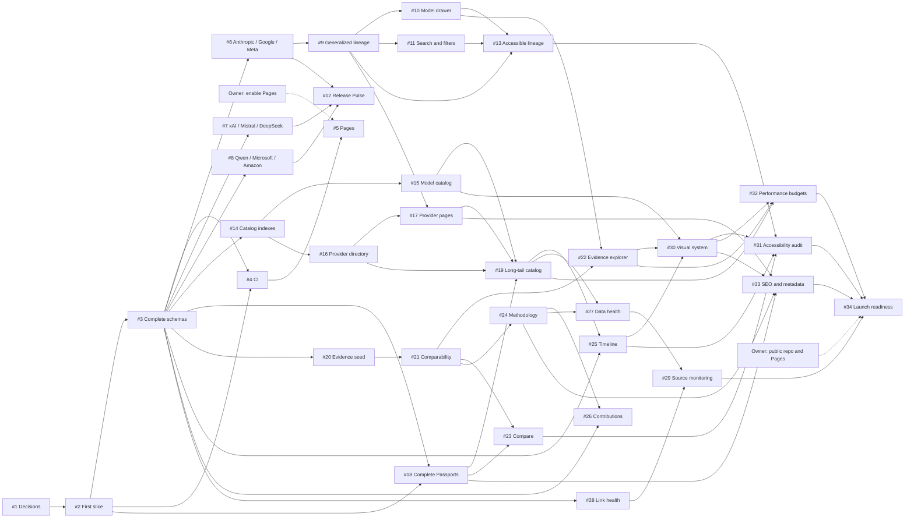

# ModelTree Delivery Backlog

GitHub is the source of truth for issue status. This document records the
initial dependency model and MVP boundary established on 2026-08-14.

## First Vertical Slice

Issue #2 proves the architecture end to end:

> Deployable Astro shell + validated OpenAI seed data + one interactive family
> lineage + one Model Passport + visible primary-source attribution.

It deliberately precedes bulk schema and provider expansion so the team can
change the architecture while the data surface is still small.

## Critical Path

The graph includes every MVP issue and each direct dependency. Dashed owner
gates are repository settings rather than implementation work.

Issue #5 and issue #34 were blocked until a repository owner enabled Pages and
changed the then-private repository to public. Both owner gates were satisfied
before 2026-08-27: the repository is public and Pages is live. The dashed gates
stay on the graph because they are real dependencies of that path, not because
they are still outstanding. No product code should attempt those settings
changes. See [`DEPLOYMENT-RUNBOOK.md`](DEPLOYMENT-RUNBOOK.md).

## MVP Issues

| Issue | Milestone | Outcome | Dependencies |
|---|---|---|---|
| #1 | M0 | Product brief, IA, ADR, and backlog | None |
| #2 | M0 | First source-backed vertical slice | #1 |
| #3 | M0 | Complete entity schemas and integrity checks | #2 |
| #4 | M0 | CI for data, types, tests, and build | #2, #3 |
| #5 | M0 | GitHub Pages deployment | #4, owner setting |
| #6 | M1 | Anthropic, Google, and Meta featured data | #3 |
| #7 | M1 | xAI, Mistral, and DeepSeek featured data | #3 |
| #8 | M1 | Qwen, Microsoft, and Amazon featured data | #3 |
| #9 | M1 | Multi-ecosystem lineage explorer | #6 |
| #10 | M1 | Model drawer and evidence actions | #9 |
| #11 | M1 | Homepage search, filters, and URL state | #9 |
| #12 | M1 | Release Pulse and coverage statistics | #6, #7, #8 |
| #13 | M1 | Mobile, keyboard, and reduced-motion hardening | #9, #10, #11 |
| #14 | M2 | Scalable catalog indexes and pagination | #3 |
| #15 | M2 | Searchable model catalog | #14 |
| #16 | M2 | A-Z creator and platform directory | #14 |
| #17 | M2 | Provider detail pages | #9, #16 |
| #18 | M2 | Complete Model Passport | #2, #3 |
| #19 | M2 | Reviewed long-tail catalog | #15, #16, #17, #18 |
| #20 | M3 | Reviewed benchmark definitions and results | #3 |
| #21 | M3 | Comparability rules and transformations | #20 |
| #22 | M3 | Benchmark evidence explorer | #10, #21 |
| #23 | M3 | Two-to-four-model comparison | #18, #21 |
| #24 | M3 | Methodology and evidence policy | #21 |
| #25 | M4 | Release timeline and generated changelog | #3, #19 |
| #26 | M4 | Contribution guides, templates, and corrections | #3, #24 |
| #27 | M4 | Staleness reports and data health | #19, #24 |
| #28 | M4 | Source link-health checks | #3 |
| #29 | M4 | Proposal-only official-source monitoring | #27, #28 |
| #30 | M5 | Visual system and brand mark | #15, #22, #25 |
| #31 | M5 | Independent WCAG 2.2 AA audit | #13, #23, #25, #30 |
| #32 | M5 | Performance and asset budgets | #19, #22, #30 |
| #33 | M5 | SEO, social metadata, sitemap, and structured data | #17, #18, #24, #30 |
| #34 | M5 | Open-source launch readiness | #29, #31, #32, #33, owner settings |

## Post-MVP Issues

| Issue | Outcome | Dependencies |
|---|---|---|
| #35 | Historical Time Machine | #9, #25 |
| #36 | Model DNA identity strip | #18, #30 |
| #37 | Sibling tier explanations | #9, #24 |
| #38 | Shareable lineage trails | #9 |
| #39 | Transparent decision paths | #15, #22, #24 |
| #40 | Source-qualified family face-off | #23, #37 |
| #41 | Accessible embeddable lineage cards | #31, #33 |
| #42 | Additional model categories | #19, #24 |
| #43 | Explain this name glossary | #18, #24 |
| #44 | Reproducible evaluation harness design | #22, #24 |

## Ordered Execution

1. Complete #1, then deliver and deploy the #2 vertical slice through #4 and #5.
2. Run source-reviewable data batches #6-#8 in parallel; generalize the homepage
   through #9-#13 once the first expansion batch lands.
3. Build shared indexes #14, then directory and detail work #15-#19 in parallel
   where dependencies allow.
4. Establish evidence data and comparability #20-#21 before UI work #22-#24.
5. Add freshness and contribution operations #25-#29 before launch hardening.
6. Complete visual, accessibility, performance, metadata, and owner checks
   #30-#34; only then consider post-MVP issues #35-#44.

## Backlog Rules

- One issue should produce one focused, independently reviewable pull request.
- A blocked label is used only for an explicit unresolved dependency.
- Data pull requests open and verify underlying sources; search snippets are not
  stored evidence.
- Automation may propose factual changes but cannot publish them.
- Unknown and conflicting values remain explicit; no implementation fills them
  from similarly named releases.