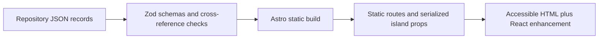

# ModelTree Information Architecture

## Route Map

| Route | Purpose | Primary interaction |
|---|---|---|
| `/` | Signature lineage experience | Select ecosystem, family, and release; open details |
| `/tree/` | Dedicated semantic model tree | Progressively disclose reviewed creator, family, and release branches |
| `/models` | Complete model catalog | Search, filter, sort, paginate, share query state |
| `/models/[slug]` | Model Passport | Inspect identity, lineage, access, evidence, and sources |
| `/providers` | Creator and provider directory | Search and jump A-Z |
| `/providers/[slug]` | Organization profile | Explore family tree, releases, products, and platforms |
| `/benchmarks` | Benchmark evidence | Compare source-backed results within compatible contexts |
| `/compare` | Two-to-four-model comparison | Compare facts and comparable evidence without a winner |
| `/updates` | Chronological release view | Filter verified changes by date, creator, and category |
| `/methodology` | Editorial and data policy | Understand inclusion, terminology, and verification |

All user selections that define a useful view use stable query parameters. The
homepage starts with `provider` and `model`; catalog routes add filters and sort;
evidence uses `models=<slug,slug>` plus optional `domain` and `benchmark`.

## Navigation

The compact global header contains ModelTree, Explore, Model Tree, Models, Providers,
Evidence, Updates, and Methodology. On small screens, the same links use a
keyboard-accessible disclosure menu. The homepage is the product experience,
not a marketing gate.

`/` remains the broad signature experience and catalog overview. `/tree/` is a
complementary, focused hierarchy for mind-map-style progressive disclosure:
AI Model Ecosystem → Featured ecosystems → creator → model family → model release.
An `Others` branch sits beside Featured and is derived the same way from the same
catalog: it holds every creator that has reviewed releases but no featured one,
rendered as the same expandable creator → family → release disclosures, and it
shows a factual empty state only while no such creator exists. Both branches
derive membership from reviewed catalog flags and neither implies popularity or
rank. The complete hierarchy is server-rendered; client JavaScript enhances
disclosure, selection, and stable `?model=<release-id>` deep links.

A creator is featured when this repository keeps a dedicated reviewed source
profile for it, as a file at the top level of `tools/updater/profiles/`. That
directory is the whole of the criterion and can be listed to check it. Its
`generic/` subdirectory holds the long-tail review policy and its `origins/`
subdirectory holds approved source hosts; `origins/README.md` states that those
documents are not profiles and join neither reviewed set, so a creator with an
origin catalogue and no profile is not featured by it.

Featuring therefore says how deeply this repository has vetted a creator's
sources. It is a statement about our own editorial coverage, not a claim about
the creator's size, standing, or the quality of its models, and it does not
imply popularity or rank. It is also self-correcting rather than permanent: a
long-tail creator that later earns a reviewed profile moves to Featured by
satisfying the criterion.

## Homepage Composition

1. Header and one-sentence product statement
2. Featured ecosystem selector
3. Interactive lineage explorer with an accessible HTML representation
4. Model detail drawer or anchored panel
5. Compact Release Pulse
6. Coverage counts and latest verification date

The first viewport shows the brand, purpose, and usable lineage controls while
leaving a visible hint of recent releases below.

## Component Architecture

### Static Astro components

- `BaseLayout`: metadata, canonical URL, navigation, and footer
- `BrandMark`: repository-controlled mark and text fallback
- `HeroIntro`: literal product statement and coverage summary
- `ModelPassport`: source-backed model detail sections
- `SourceList`: primary sources and verification metadata
- `ReleasePulse`: recent verified release events

### React islands

- `LineageExplorer`: provider selection, lineage state, keyboard movement, URL sync
- `CatalogFilters`: deferred search, filters, sorting, and result summary
- `EvidenceExplorer`: model and benchmark selection with comparability states
- `CompareTray`: persistent two-to-four-model selection

The server renders meaningful headings, controls, and a vertical lineage list.
JavaScript enhances layout and selection; it is not required to read the data.
No graph library is added until measured complexity justifies its bundle cost.

## Data Flow

Validation fails for malformed required fields, duplicate IDs or slugs,
impossible dates, broken organization/family/lineage references, and featured
releases without a primary source. Unknown optional facts stay absent rather
than receiving guessed defaults.

## Responsive Lineage Behavior

- Desktop: provider rail, branching family layout, and anchored details panel
- Tablet: compact provider control and collapsible family branches
- Mobile: provider to family to release drill-down with a vertical chronology
- Reduced motion: state changes occur without animated traversal

## Accessibility Contract

- Native buttons, links, headings, landmarks, lists, and dialog semantics
- Roving or conventional tab navigation documented in component tests
- Visible focus and non-color status labels
- Selection announced through accessible names and live status where useful
- A text alternative contains the same releases and relationships as the visual
- Touch targets, contrast, and interactions meet WCAG 2.2 AA

## Content Boundaries

Organizations, families, releases, products, serving platforms, pricing,
benchmarks, benchmark results, and sources remain separate records. Pages join
them for presentation but do not collapse creator into provider, product into
model, or open-weight into open-source.

An organization's required `type` is an editorial functional category, not a
sourced statement of legal form and not a ranking. The first matching category
wins: `community` when independent contributors outside any one entity's
employment or appointment chain can initiate and decide its model releases, not
merely submit work; `company` when the entity offers model products or access
for payment under its name, without counting a parent's sales; `research-lab`
when one standalone institution or named unit controls releases and exists
primarily for research; `nonprofit` when a centrally governed nonprofit matches
none of those tests; otherwise `company` for the centrally operated creator that
runs the model work. The review rubric applies this observable decision
procedure without requiring a primary-source quote to use the category's exact
words.