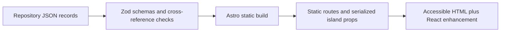

# ModelTree Information Architecture

## Route Map

| Route | Purpose | Primary interaction |
|---|---|---|
| `/` | Signature lineage experience | Select ecosystem, family, and release; open details |
| `/tree/` | Dedicated semantic model tree | Progressively disclose reviewed creator, family, and release branches |
| `/models` | Complete model catalog | Search, filter, sort, paginate, share query state |
| `/models/[slug]` | Model Passport | Inspect identity, lineage, access, evidence, and sources |
| `/providers` | Creator and provider directory | Search and jump A-Z |
| `/providers/[slug]` | Organization profile | Explore family tree, releases, products, and platforms |
| `/benchmarks` | Benchmark evidence | Compare source-backed results within compatible contexts |
| `/compare` | Two-to-four-model comparison | Compare facts and comparable evidence without a winner |
| `/timeline` | Chronological release view | Group releases and release events by period; filter by creator, category, and access |
| `/updates` | Recorded release-event ledger | Read what changed with its note, kind, source, and check date; filter by creator and category |
| `/updates/changelog.md` | Generated public changelog | Read or copy the same records as plain Markdown; build-emitted, never committed |
| `/methodology` | Editorial and data policy | Understand inclusion, terminology, and verification |

`/timeline` and `/updates` answer different questions and are deliberately not
merged. `/timeline` is the chronology — when each model appeared — and covers
releases as well as events, one line each. `/updates` is the change ledger: only
recorded release events, each carrying the source's own what-changed note, the
kind of change, the primary sources, and the day the record was last re-checked.
Both order by the date the *source* stated; neither treats a verification date as
a release date.

`/updates/changelog.md` is generated at build time from the records `/updates`
renders, through one intermediate feed-shaped representation. It is not committed
to the repository: a checked-in copy would be a second source for facts the
dataset already holds, and would drift the first time one was edited and not the
other. That representation is deliberately feed-shaped, but no RSS or Atom
document is served — a subscribable feed is a promise about update cadence this
project does not yet make.

All user selections that define a useful view use stable query parameters. The
homepage starts with `provider` and `model`; catalog routes add filters and sort;
evidence uses `models=<slug,slug>` plus optional `domain` and `benchmark`.

## Navigation

The compact global header contains ModelTree, Explore, Model Tree, Models, Providers,
Evidence, Timeline, and Methodology. On small screens, the same links use a
keyboard-accessible disclosure menu. The homepage is the product experience,
not a marketing gate.

`/` remains the broad signature experience and catalog overview. `/tree/` is a
complementary, focused hierarchy for mind-map-style progressive disclosure:
AI Model Ecosystem → Featured ecosystems → creator → model family → model release.
An `Others` branch sits beside Featured and is derived the same way from the same
catalog: it holds every creator that has reviewed releases but no featured one,
rendered as the same expandable creator → family → release disclosures, and it
shows a factual empty state only while no such creator exists. Both branches
derive membership from reviewed catalog flags and neither implies popularity or
rank. The complete hierarchy is server-rendered; client JavaScript enhances
disclosure, selection, and stable `?model=<release-id>` deep links.

Membership in either branch presupposes a record that was admitted to the catalog
at all, which is a separate and earlier decision. That procedure is recorded
beside `datasetSchema` in `web/src/data/schema.ts`, published here word for word
so this document and the schema cannot say different things:

<!-- catalog-inclusion-policy:start -->
What earns a record a place in this dataset, and what keeps it out. Apply in
order: record exactly one entity kind per record, so a fact about a creator, a
family, a release, a product, a serving platform, a source, or a publisher lives
on that entity and never on a neighbour; cite at least one primary source and
carry the day it was read, which every record-bearing schema above requires of
itself rather than leaving to judgement; leave a field unset when no cited source
states it, because a blank is a fact this dataset publishes happily -- nobody has
sourced this yet -- and a plausible value no source states is not a fact at all;
withhold the whole record when its required fields cannot be sourced that way,
and record the gap rather than the guess, so that what is missing stays visible
instead of being smoothed over; and admit the record only as a reviewed change to
this repository, never as runtime input and never as an open crawl, per ADR 0002.
Inclusion decides presence and nothing else. It states no order, no score, and no
rank; it is not the `featured` procedure recorded beside that field, which is
applied afterwards and only to releases already admitted here; and a record
admitted by this procedure gains its catalog entry, its canonical route, and its
correction path whether or not any editorial list names it.
<!-- catalog-inclusion-policy:end -->

The criterion for the Featured branch is the decision procedure recorded beside
the `featured` field in `web/src/data/schema.ts`, published here word for word so
this document and the schema cannot say different things:

<!-- featured-policy:start -->
Editorial lead selection, not a ranking and not a sourced claim. Apply in order:
flag `featured` only on a release whose creator is one of the five this site
leads with -- `anthropic`, `google-deepmind`, `meta`, `microsoft`, `openai`; flag
at least one release for each of those five, so that each one reaches the
Featured branch, because a creator is featured exactly when it holds a featured
release and the schema carries no organization-level flag; flag no release of any
other creator, which is what places every creator the list omits on the Others
branch; and write a `featuredRationale` on exactly the releases flagged, so that
no rationale outlives the placement it explains. The list records what this site
leads with, which is a choice about its own entry point rather than a measurement
of the creators: it states no order, no score, and no claim that a listed creator
is larger, better, or more important than one it omits. A creator the list omits
keeps every catalog entry, every release, its place on the Others branch, and its
own provider page. Changing the five is an editorial change to this list,
reviewed like any other change here.
<!-- featured-policy:end -->

Featuring therefore says where this site starts a reader. It is not a claim about
a creator's size, standing, or the quality of its models, and it does not imply
popularity or rank. It is also not a filter on the data: a creator the list omits
is recorded exactly as fully as one it names, and keeps its own provider page --
`providerStaticPaths` generates a page for every organization that has at least
one release, reading no flag at all, so an editorial change to the list can never
delete a page.

## Homepage Composition

1. Header and one-sentence product statement
2. Featured ecosystem selector
3. Interactive lineage explorer with an accessible HTML representation
4. Model detail drawer or anchored panel
5. Compact Release Pulse
6. Coverage counts and latest verification date

The first viewport shows the brand, purpose, and usable lineage controls while
leaving a visible hint of recent releases below.

## Component Architecture

### Static Astro components

- `BaseLayout`: metadata, canonical URL, navigation, and footer
- `BrandMark`: repository-controlled mark and text fallback
- `HeroIntro`: literal product statement and coverage summary
- `ModelPassport`: source-backed model detail sections
- `ModelDna`: the identity strip on a passport — one labelled value per fixed
  identity dimension, in an order that does not vary between models, with an
  unrecorded dimension keeping its place and saying so. Rendered statically like
  its parent: it carries no score, no ranking, and no client JavaScript.
- `SourceList`: primary sources and verification metadata
- `ReleasePulse`: recent verified release events

### React islands

- `LineageExplorer`: provider selection, lineage state, keyboard movement, URL sync
- `CatalogFilters`: deferred search, filters, sorting, and result summary
- `EvidenceExplorer`: model and benchmark selection with comparability states
- `CompareTray`: persistent two-to-four-model selection

The server renders meaningful headings, controls, and a vertical lineage list.
JavaScript enhances layout and selection; it is not required to read the data.
No graph library is added until measured complexity justifies its bundle cost.

## Data Flow

Validation fails for malformed required fields, duplicate IDs or slugs,
impossible dates, broken organization/family/lineage references, and featured
releases without a primary source. Unknown optional facts stay absent rather
than receiving guessed defaults.

## Responsive Lineage Behavior

- Desktop: provider rail, branching family layout, and anchored details panel
- Tablet: compact provider control and collapsible family branches
- Mobile: provider to family to release drill-down with a vertical chronology
- Reduced motion: state changes occur without animated traversal

## Accessibility Contract

- Native buttons, links, headings, landmarks, lists, and dialog semantics
- Roving or conventional tab navigation documented in component tests
- Visible focus and non-color status labels
- Selection announced through accessible names and live status where useful
- A text alternative contains the same releases and relationships as the visual
- Touch targets, contrast, and interactions meet WCAG 2.2 AA

## Content Boundaries

Organizations, families, releases, products, serving platforms, pricing,
benchmarks, benchmark results, and sources remain separate records. Pages join
them for presentation but do not collapse creator into provider, product into
model, or open-weight into open-source.

<!-- organization-type-policy:start -->Editorial functional classification,
not a sourced claim. Choose the first match: `community` when independent
contributors outside any one entity's employment or appointment chain can
initiate and decide its model releases, not merely submit work; `company` when
the entity offers model products or access for payment under its name (a
parent's sales do not count); `research-lab` when one standalone institution or
named unit controls releases and exists primarily for research; `nonprofit`
when a centrally governed nonprofit matches none above; otherwise `company` for
the centrally operated creator that runs the model
work.<!-- organization-type-policy:end -->

An organization's required `type` therefore classifies function rather than
legal form and is not a ranking. The review rubric applies this observable
decision procedure without requiring a primary-source quote to use the
category's exact words.